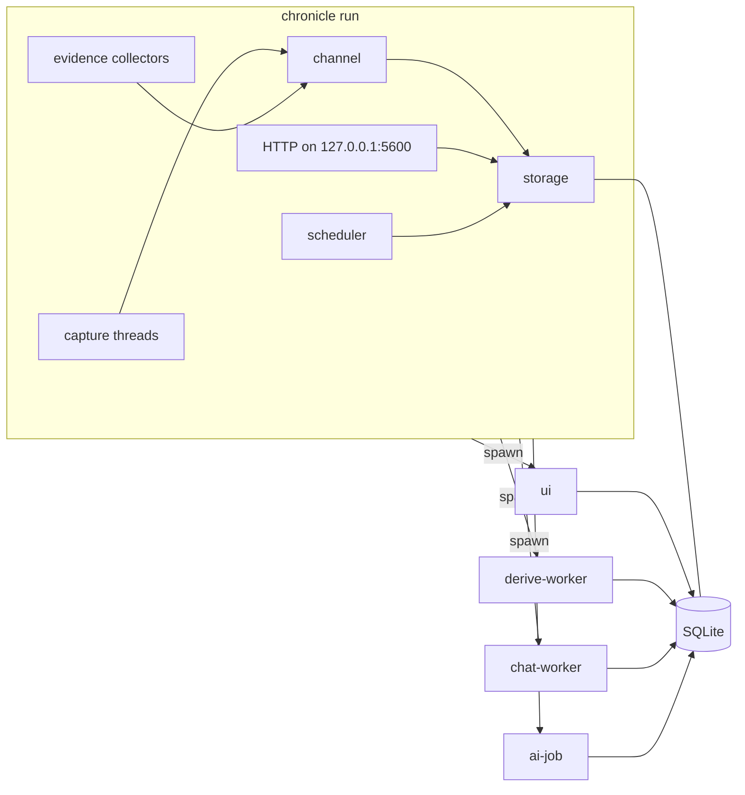
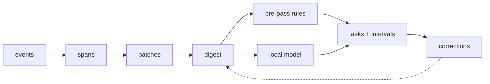

# Chronicle

Chronicle is a time tracker for developers that runs entirely on your own
machine. A background daemon records which window has focus and when you
step away, then files that time into the tasks you were working on. It works
from evidence it can read locally: a ticket key in a window title or branch
name, the folder a terminal is in, what you filed a similar window under
before, and a small local language model for whatever the rules cannot place.
When it gets something wrong you correct it, and the correction is used next
time.


- Nothing leaves your machine unless you connect a cloud model or an MCP
  server yourself. It has no account, no server and no telemetry.
- Corrections are kept and read before the next run, and once a day it
  scores its own placements against them.
- It runs on Linux (X11 and Wayland). The macOS port compiles but has not
  been run on real hardware yet. Windows is planned.

The site is [chronicled.dev](https://chronicled.dev/). The reference pages
are under [`docs/`](docs/README.md): configuration, the CLI, what is stored,
the sources and the architecture. [CONTRIBUTING.md](CONTRIBUTING.md) covers
building and submitting changes.

## Installing

```sh
# Linux or macOS, shell installer
curl --proto '=https' --tlsv1.2 -LsSf https://github.com/james-clarke/chronicle/releases/latest/download/chronicle-installer.sh | sh

# Homebrew
brew install james-clarke/tap/chronicle

# from source
cargo install --path crates/app
```

Then:

```sh
chronicle model pull        # the default local model, about 2.5 GB
chronicle service install   # run at login (systemd user unit or LaunchAgent)
chronicle status            # is it healthy, what is it reading
```

The default model is Qwen3-4B at Q4_K_M, which needs roughly 4 GB of RAM
while it runs. `chronicle model pull qwen3-1.7b` is the smaller fallback.
Without a model the daemon still captures and files what the rules can; only
the model step is skipped. Each release also ships a `.tar.xz` per target
with checksums.

On macOS the first run asks for Accessibility permission so it can read
window titles. Without it the app names are still captured but the titles
are empty.

## What it stores

Window titles, URLs, and when you were idle or away. Activity rows from the
sources you connect: git commits and checkouts, AI coding session summaries,
browser history, editor heartbeats, shell sessions as a working directory
and a program name (never the command line), calendar events, and whether
the microphone is in use. Per-minute counts of keys and mouse events, never
which keys. No screenshots. Apps and titles you exclude in settings are never
written to disk at all.

Everything sits in one SQLite file in the data directory (XDG on Linux,
`~/Library/Application Support` on macOS, `%APPDATA%` on Windows), kept for
180 days by default.

## How it works

Chronicle is one binary that runs as several processes. The daemon captures
and stores. Anything that needs a GPU or a language model runs as a child
process the daemon spawns, so a crash in the UI or the model never takes
capture down.



The data goes through a few named stages. Raw focus changes are **events**.
Consecutive events on the same window merge into **spans**. Thirty minutes
of non-idle activity is a **batch**, and the compact text summary of a batch
that the model reads is its **digest**. Turning a digest into **tasks** and
the time **intervals** under them is called **derivation**. A **pre-pass**
of plain rules runs before the model and places whatever it can on its own.
When you rename, move or reject something, that is a **correction**, and
corrections are pulled into the next digest as examples.



## Workspace

```
chronicle/
├── crates/
│   ├── core/       # types, config, storage, sessionizer, pre-pass, digest, evidence
│   ├── capture/    # platform capture behind traits, plus the evidence collectors
│   ├── server/     # localhost HTTP endpoint speaking ActivityWatch and WakaTime
│   ├── derive/     # prompt building, llama.cpp runner, grammars, cloud backends
│   ├── mcp/        # MCP client config and allowlisted calls
│   └── app/        # the chronicle binary: CLI, daemon, egui UI, worker processes
├── grammars/       # one GBNF grammar and JSON schema per structured output
├── prompts/        # prompt files for the model jobs
├── packaging/      # systemd user unit, macOS LaunchAgent plist
├── scripts/        # mac-check.sh, wayland-check.sh, site-shots.sh
├── fixtures/       # recorded event streams, golden outputs, eval expectations
├── docs/           # reference pages and the generated connector list
└── site/           # the static site, built by site/build.sh
```

Subcommands, as `chronicle --help` lists them:

- `run` starts the daemon (the default)
- `toggle` shows or hides the window
- `status [--json]` reports daemon health and recent activity
- `dump [--day YYYY-MM-DD]` prints stored data
- `report` prints a timesheet as CSV or markdown
- `standup` prints the drafted standup for a day
- `task {list,add,close,rename,current}` declares and edits tasks
- `project {list,test,rebuild}` manages the rules that file time into a project
- `model {pull,list}` manages local models
- `connections [--json|--html]` lists every tool Chronicle can read and its state here
- `setup` sorts those into working, one step away, and needs an account
- `shell-init <shell>` prints the shell hook for your rc file
- `hooks {install,remove,status,backfill}` manages git hooks for exact-second checkouts and commits
- `gcal-login` signs in to Google Calendar
- `mcp-check` runs the allowlisted MCP calls and prints what derivation would see
- `service {install,remove,status}` manages run-at-login
- `anchors`, `evidence`, `backfill-embeddings`, `backfill-descriptions` inspect and repair stored derivations

## Capture

Platform code sits behind four traits in `crates/capture` (`FocusProvider`,
`AfkProvider`, `PresenceProvider`, `LockSignal`), and everything downstream
consumes `CaptureEvent` values and nothing else. X11, Wayland (wlroots and
KDE) and macOS each have an implementation. Windows is planned.

The evidence collectors (git, AI session transcripts, browser history, the
shell hook, editor heartbeats, calendars, microphone) each run on their own
thread and write rows to `activity_events`. `chronicle connections` lists
every collector with its state on this machine, and
[docs/sources.md](docs/sources.md) says how to connect each one.

## Storage

SQLite in WAL mode through `rusqlite` with the bundled FTS5, migrated on
open. The tables split into capture, derivation, evidence, the
model-written layer and measurement. All timestamps are UTC unix
milliseconds, and day boundaries are computed at query time with `jiff`.
[docs/data.md](docs/data.md) lists every table, what leaves the machine,
and how to prune, export or delete.

## Sessionizer and digest

This stage is deterministic and never calls the model. Consecutive events
with the same app and a similar title merge into a span. Spans under 5 s fold
into a context-switching span, and 120 s of idle time closes one. Thirty
minutes of non-idle activity becomes a batch. Its digest is capped at 2 200
tokens and carries the top apps, a per-minute timeline, the open tasks
numbered so the model can refer to them by index, similar past corrections,
and any MCP context. The rules are in
[docs/architecture.md](docs/architecture.md).

## Derivation

The pre-pass files what rules can. A ticket key in a title or branch, a
terminal's working directory, a window you filed before and a matching
correction each place time without the model. What is left goes to a
resident `derive-worker` running llama.cpp under a GBNF grammar (in
`grammars/`, with the prompts in `prompts/`), so the model can only emit
task JSON: intervals that reference an open task by index or propose a new
label. The output is sanitized, snapped, coalesced and clamped before it is
stored.

The scheduler derives after 5 minutes idle or locked, or when system load is
low, and waits if the battery is under 30 %. `chronicle bench` scores model
output against the expectations in `fixtures/*.expect.json`, and a real
derivation failure becomes a fixture before it gets fixed. Cloud backends
are optional and use your own API key.

## MCP

MCP is optional. The config is `<data_dir>/mcp.toml`, and a missing file
means it is off. `[[servers]]` entries are a stdio command or a URL,
`[[context_calls]]` run at derive time and feed the digest, and
`[[fetch_calls]]` run once per task with its ticket key. Everything fetched
this way, like every window title and URL, is treated as untrusted text to
label time with, and the grammar is what keeps the model from doing anything
else with it. [docs/sources.md](docs/sources.md) has the full example.

## Configuration

`config.toml` lives in the data directory and is read when the daemon
starts. The Settings panel writes the same file. The fields you are most
likely to touch are `excluded_apps` and `excluded_titles` (regexes, never
stored), `retention_days`, `dev_roots`, `git_repos`, `capture_presence`, `focus_route`
(`auto`, `x11`, `wlr` or `kwin`), `derive_idle_secs` and `port`. Every
field with its default is in [docs/configuration.md](docs/configuration.md).

## Conventions

`anyhow` in binaries and `thiserror` in libraries. `tracing` with a 5 MB
rotating file log. Stable Rust, pinned by `rust-toolchain.toml`. Tests are
fixture-driven: a mock `FocusProvider` replays JSONL, and the sessionizer
and digest are checked against golden files. Every change passes
`cargo fmt --check`, `cargo clippy --workspace --all-targets -- -D warnings`
and `cargo test --workspace` before it lands.

## License

AGPL-3.0-only. Copyright © 2026 James Clarke.

The full text is in `LICENSE`, unmodified. The copyright line sits here and
not at the top of that file because licence detectors read a modified GNU
header as a different licence.
