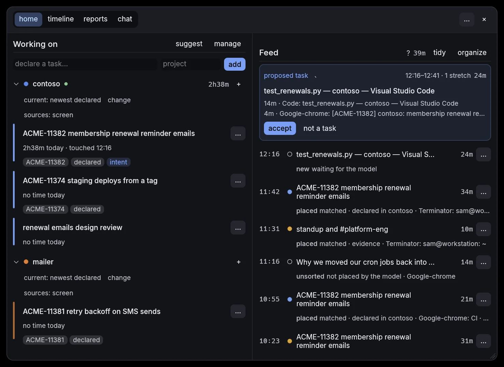

# Chronicle

Chronicle is a small window in the corner of your screen that knows what you
worked on, for how long, and why. A daemon watches which window is in front
and when you step away, and files that time into the tasks you were actually
doing: a ticket key in a tab, the folder a terminal is in, a branch name, a
window you filed before, and a local language model for what the rules cannot
place. It writes the standup, draws the day in lanes, adds the week up by
project, and answers questions about any of it, from one SQLite file on your
own disk.



- **Local first.** One binary, no account, no server, no telemetry. The
  language model runs on your CPU. Nothing leaves the machine unless you
  configure it to: an MCP server you added, or a cloud model you brought a
  key for. Settings › Storage & server lists exactly what those are.
- **Correctable.** Rename a task, move a block, throw one out; the
  correction is kept and read first next time. Once a day it scores its own
  placements and prints the result in `chronicle status`.
- **Linux X11 and Wayland today, macOS ported but unsigned, Windows not
  yet.** The [platform matrix](#platform-matrix) below says what each route
  actually does.

The site is [chronicled.dev](https://chronicled.dev/). Install from
[Installing](#installing); the licence is [AGPL-3.0](#license). The design
record is [`docs/`](docs/README.md): one plan per milestone, written before
the code, with what shipped and what is still owed.

## How this document is organised

Everything from here to [Milestones](#milestones) is the working reference
for the code as it stands: the stack, the platform matrix, and one section
per subsystem, each pointing at the plan that shaped it. It is kept in step
with the tree, not with intentions. [How this was built](#how-this-was-built)
at the end is the part a stranger should read first.

## Stack

| Area | Choice |
|---|---|
| Language | Rust stable, edition 2024, cargo workspace |
| UI | egui via `eframe` (no webview) |
| Tray | `ksni` (Linux, m19); `tray-icon` (macOS, m38); Windows deferred |
| Storage | `rusqlite` (`bundled` + FTS5), WAL, `rusqlite_migration` |
| Time | `jiff` (IANA tzdb, DST-correct; `time`'s local-offset lookup is unsound in threaded daemons) |
| LLM | llama.cpp embedded via `llama-cpp-2` (pin exact version; no semver) |
| Model | Qwen3-4B-Instruct-2507 Q4_K_M GGUF; Qwen3-1.7B as the low-RAM fallback (settled by the M4 benchmark) |
| HTTP | `axum`, `127.0.0.1` only |
| MCP | `rmcp` (official SDK, pin version), stdio only |
| Linux capture | `x11rb` (X11); `wayland-client` + `wayland-protocols-wlr`/`-plasma` and a KWin script over `zbus` (Wayland, m39) |
| Windows capture | `windows` crate |
| macOS capture | `objc2`/`objc2-app-kit` (`NSWorkspace`), `objc2-core-foundation`; `AX*`/`CGEventSource*`/`CGSessionCopyCurrentDictionary`/`AudioObjectGetPropertyData` as hand-written `extern "C"` in `ffi.rs` (m38) |
| Concurrency | sync threads + `crossbeam-channel`; tokio confined to `server` + `mcp` |

## Platform matrix

| | Linux X11 | Linux Wayland (m39) | macOS | Windows |
|---|---|---|---|---|
| Focus events | `_NET_ACTIVE_WINDOW` + per-window `PropertyChangeMask` | `zwlr_foreign_toplevel_manager_v1`; KWin script over D-Bus on KDE | `NSWorkspace.didActivateApplicationNotification` + AXObserver | `SetWinEventHook` (FOREGROUND + NAMECHANGE) |
| Titles | `_NET_WM_NAME` → `WM_NAME`; app = `WM_CLASS` | toplevel `title`; app = `app_id` (KWin: `caption` / `resourceClass`) | AX `kAXTitle` | `GetWindowTextW`; app = `QueryFullProcessImageNameW` |
| Focused pid | `_NET_WM_PID` | compositor IPC (sway, Hyprland, Niri); KWin reports it | `NSRunningApplication` | process of the window |
| AFK | XScreenSaver `QueryInfo` | `ext-idle-notify-v1`, else `org_kde_kwin_idle` | `CGEventSourceSecondsSinceLastEventType` | `GetLastInputInfo` |
| Presence counts | XI2 raw events, counted per minute | none (no protocol reports input) | `CGEventSourceCounterForEventType` | `GetLastInputInfo` + low-level hook |
| Screen lock | logind D-Bus `LockedHint` | logind D-Bus `LockedHint` | `com.apple.screenIsLocked` notification | WTS session notifications |
| Tray | `ksni` StatusNotifierItem (m19) | `ksni` StatusNotifierItem (m19) | `tray-icon` status item (m38) | yes |
| Open UI | app icon / `chronicle toggle` | app icon / `chronicle toggle` | tray click | tray click |
| Autostart | `systemd --user` unit | `systemd --user` unit | LaunchAgent plist | HKCU `Run` key |
| LLM accel | CPU (Vulkan opt) | CPU (Vulkan opt) | Metal | CPU (Vulkan opt) |
| Battery guard | `/sys/class/power_supply` | `/sys/class/power_supply` | IOKit (or skip v1) | `GetSystemPowerStatus` |

Platform notes:
- **Linux launch UX:** daemon holds a unix socket. Any second invocation (`chronicle` or `chronicle toggle`) sends toggle and exits; daemon spawns the UI child, or forwards a raise if it's already alive. No tray.
- **Linux autostart (m11):** `systemd --user` unit (`packaging/chronicle.service`) is the sole Linux autostart mechanism — a supervised lifecycle (SIGTERM on `stop`, `Restart=on-failure`) is what makes the clean-shutdown path exercisable; a bare XDG `.desktop` entry has no stop contract. `WantedBy=graphical-session.target`, not `default.target`, since capture needs `DISPLAY` (or `WAYLAND_DISPLAY`, plus `SWAYSOCK`/`NIRI_SOCKET`/`HYPRLAND_INSTANCE_SIGNATURE` for the pid lookup, m39).
- **Presence (m32):** the `presence` table holds per-minute counts only — how many keys, buttons, motion and scroll events — never which keys; `capture_presence = false` turns it off. X11 and macOS only: no Wayland protocol reports input to an ordinary client, and evdev needs the `input` group no packaged install grants, so the Wayland routes skip it and log one line. Idle shorter than `quiet_secs` (10 min; `away_secs` 30 min with an agent writing, a call or a meeting on screen) stays inside the span as quiet time, so reading and watching an agent are not cut as absence.
- **X11:** windows die racily, all property reads must tolerate `BadWindow`/`BadDrawable` as non-fatal. Subscribe `PropertyChangeMask` on each new active window (catches tab-title changes), unsubscribe previous. Debounce title changes 1 s.
- **Linux Wayland (m39):** shipped — the route is chosen at start from `focus_route` (`auto | x11 | wlr | kwin`) and the session environment, and `chronicle status` prints it. wlroots compositors go through `zwlr_foreign_toplevel_manager_v1`, event-driven like X11 with the same 1 s title debounce; the protocol carries no pid, so sway's, Hyprland's and Niri's own sockets are asked for it and the terminal cwd probe works there. KDE goes through a KWin script that reports over the session bus (`dev.chronicled.Chronicle`), since KWin does not expose the window-management protocol to ordinary clients; every `callDBus` argument crosses as a string because KWin picks the D-Bus type of a JS number unpredictably and a mismatched signature is dropped silently. Idle is `ext-idle-notify-v1` with `org_kde_kwin_idle` as the older-compositor fallback; lock stays logind. GNOME needs a Shell extension and is not shipped: it gets one line naming itself and the `focus_route = "x11"` Xwayland fallback. Check either route from an X11 login with `scripts/wayland-check.sh sway|kwin`, which drives a nested compositor.
- **macOS (m38):** shipped — 1 s poll of `NSWorkspace.frontmostApplication` + the AX focused window title (not event-driven: AX permission is a card, not a blocker — untrusted just means empty titles); `CGEventSourceSecondsSinceLastEventType` for idle and `CGEventSourceCounterForEventType` for presence counts; `CGSessionCopyCurrentDictionary()["CGSSessionScreenIsLocked"]` polled every 2 s for the lock flag; `lsof -iTCP -sTCP:LISTEN` for ports; CoreAudio's `kAudioDevicePropertyDeviceIsRunningSomewhere` for mic-in-use (app is always "microphone" — no TCC-gated tap); autostart via a LaunchAgent installed by `chronicle service install` (same CLI/onboarding path as Linux's systemd unit); Homebrew formula via cargo-dist. Daemon owns the main-thread run loop for `NSApplication` (activation policy Accessory, no Dock icon) and hosts the `tray-icon` status item; the capture/server loop moves to a `daemon-main` thread. UI stays a child process. EventKit (Calendar/Reminders) is deferred — ICS subscriptions (m37) cover the calendar route on every platform without the extra entitlement and TCC prompt.
- **Windows:** dedicated capture thread with `GetMessage` pump, `WINEVENT_OUTOFCONTEXT`; tray shares the daemon's message pump. UI stays a child process.

## Non-functional requirements

- Daemon is headless. UI, derivation, and chat are all child processes of the same binary: UI = `ui` child spawned by `toggle` (spawn-or-raise), exits fully on window close (crash isolation: a GPU/driver failure can't take down capture); derivation = ephemeral worker; chat = warm worker, killed on panel close. Model never resident in the daemon.
- Daemon RSS < 50 MB. UI-child RSS is measured but not bound by this. Cost accepted: ~100–300 ms cold open on toggle.
- Event-driven capture. Only polls: AFK check ≤ 1/30 s, scheduler tick.
- egui never repaints while idle: no unconditional `request_repaint()` in `update()`; background threads wake the UI via the repaint callback.
- All servers bind `127.0.0.1` **and** strictly validate the `Host` header (DNS-rebinding defense: ActivityWatch shipped CVE-2022-31149 for exactly this).
- Platform code isolated behind traits: `FocusProvider`, `AfkProvider`, `LockSignal`, `Autostart`, `ShellIntegration` (tray/activation). Everything downstream consumes `CaptureEvent` only.

## Workspace

```
chronicle/
├── crates/
│   ├── core/       # types, config, storage, sessionizer, digest
│   ├── capture/    # provider traits + platform impls (#[cfg])
│   ├── server/     # AW-compatible localhost HTTP (axum)
│   ├── derive/     # digest→prompt, llama runner, GBNF, corrections
│   ├── mcp/        # rmcp client wrapper
│   └── app/        # binary: clap, shell integration, egui UI
├── grammars/       # one .gbnf + .json schema per structured output
├── prompts/        # derive_v5.txt, chat_v1.txt, and one per AI job
├── packaging/      # systemd user unit, macOS LaunchAgent plist
├── scripts/        # mac-check.sh, wayland-check.sh, the Messages API mock
├── fixtures/       # recorded JSONL event streams + goldens + *.expect.json evals
├── docs/plans/     # one plan per milestone, each ending in a Shipped section
└── site/           # the static site, built by site/build.sh
```

Subcommands, as `chronicle --help` lists them: `run` (daemon, default) ·
`toggle` · `status [--json]` · `dump [--day YYYY-MM-DD]` · `report` ·
`standup` · `task` · `project` · `connections [--json]` · `model` ·
`service` · `shell-init <shell>` · `hooks {install,remove,status,backfill}` ·
`gcal-login` · `mcp-check` · `anchors` · `evidence` ·
`backfill-{embeddings,descriptions}`.

Hidden, because a person never types them: `ui`, `derive`, `derive-worker`,
`chat-worker` and `hook` are spawned by the daemon or by a git hook;
`bench`, `self-score`, `ai-job` and the `backfill-*` repair commands are
development tools.

## Capture core

```rust
pub struct FocusEvent { ts: jiff::Timestamp, app: String, title: String, pid: Option<u32> }
pub enum CaptureEvent { Focus(FocusEvent), TitleChanged(FocusEvent), Url(UrlEvent), Activity(ActivityEvent), Afk { idle: bool, ts: jiff::Timestamp }, Cut { ts: jiff::Timestamp } }
pub trait FocusProvider: Send { fn run(self, tx: Sender<CaptureEvent>) -> Result<()>; } // blocking loop, own thread
pub trait AfkProvider:  Send { fn idle_ms(&self) -> Result<u64>; }                       // polled
```

Evidence collectors (m15/m22) ride the same channel as `CaptureEvent::Activity(ActivityEvent)` into `activity_events`, never `events`: git (`git_repos`), Claude Code transcripts (`ai_session_dirs`, default `~/.claude/projects`, first prompt clipped to 120 chars is all that is stored), GitHub PRs via the user's `gh` (`github_prs = true`, off by default), mic-in-use via `pw-dump` (`mic_capture`, Linux), atuin shell history (`shell_history = true`, off by default: install atuin and run `atuin import auto` once, then Chronicle reads `~/.local/share/atuin/history.db` read-only every 60 s and keeps only cwd, program name and duration — never the command line). Each runs on its own thread and is never load-bearing.

## Local sources

`chronicle connections` is the full list — every tool Chronicle can read,
what state it is in on this machine, and what it would take to connect it.
It is generated from one registry (`crates/core/src/connectors.rs`, m41),
which also drives Settings › Connections and the site's tools page, so the
three cannot drift. `chronicle connections --json` is the same table as
`docs/connectors.json`.

Most connectors need nothing: a session transcript, a git repo, a browser
history database or an editor's recent-workspace list is read wherever it
already is. `chronicle setup` (and the Setup view the app opens on a fresh
profile) sorts the rest into what is one step away and what needs an
account first. What follows is the handful with a setup step of their own.
Each runs on its own thread and is never load-bearing.

**Google Calendar** (`google_calendar = true`, or the Local sources switch in
Settings › Connections): the primary calendar only, polled every 5 min over
yesterday → tomorrow with the read-only `calendar.events.readonly` scope.
Timed events become `meeting` spans (event id, title, start/end — nothing
else); all-day events and events declined in the invite are skipped, and a
cancelled event is tombstoned to zero length so it stops covering time.

1. In Google Cloud, create an OAuth client of type **Desktop app** in the
   workspace that owns the calendar. Publish it as an **Internal** Workspace
   app: refresh tokens of an external app in "testing" expire after 7 days.
2. Export `CHRONICLE_GOOGLE_CLIENT_ID` / `CHRONICLE_GOOGLE_CLIENT_SECRET` and
   run `chronicle gcal-login`. It opens the consent screen, takes the redirect
   on `127.0.0.1:<ephemeral port>` and writes `<data dir>/google.toml` at mode
   0600 (client id/secret, refresh token, account email). The
   `--client-id …` / `--client-secret …` flags do the same, but a secret in
   argv is visible in `ps` and lands in shell history.
3. Turn Google Calendar on under Settings › Connections → Local sources and
   restart the daemon.
**Editor heartbeats (WakaTime protocol)** (`editor_heartbeats = true` by default, or the Local sources switch in Settings › Connections; off = the routes answer 403):

The same endpoint speaks WakaTime: `POST /api/v1/users/current/heartbeats.bulk` (and wakapi's single `POST /api/heartbeat`), `Authorization: Basic base64(<api_key>)`, reply `201 {"responses": [[…, 201], …]}`, 401 on a bad key, same `Host` allowlist as the AW routes. Heartbeats fold per `(project, branch)` with a 15-minute gap into `activity_events(kind='edit')`: `summary` = the file, `repo` = the project, `ext_id` = `<project>@<branch>#<span-start-ms>`, so every heartbeat inside the gap refreshes `end_ts`. Any of the ~60 WakaTime plugins works (they queue offline); no account, nothing leaves the machine. Setup:

1. Install the plugin — vim: `Plug 'wakatime/vim-wakatime'`; VS Code/JetBrains/Sublime: the WakaTime extension.
2. Copy the api key from Settings › Connections › Local sources (it is generated on first daemon start and stored in meta `wakapi_api_key`).
3. Write `~/.wakatime.cfg`:

```ini
[settings]
api_url = http://127.0.0.1:5600/api
api_key = <the key from Connections>
```


**Notes** (on whenever `git_repos` is set): each repo's
`.remember/today-*.md` is read every 60 s and each `## HH:MM | branch`
entry becomes a `note` row (time, branch, body clipped to 2000 chars). A
file is re-read only when it changes; the first poll reads them all. Notes
are ground truth for descriptions, journals and the standup — a claim there
carries the commit, session, note or journal line it came from.

**Shell history (atuin)** (`shell_history = true`, or the Local sources
switch): `~/.local/share/atuin/history.db` is read every 60 s, read-only, and
commands fold per repo (cwd matched against `git_repos`, 10-minute gap) into
`shell` spans whose summary is the top three program names by count. Only
cwd, program name and duration are kept — never the command line.

1. Install atuin and run `atuin import auto` once.
2. Turn Shell history on under Settings › Connections → Local sources (or
   `shell_history = true`).
3. Restart the daemon; only commands run after that are folded.


## Storage

SQLite, WAL, 36 migrations. Thirty tables, in five groups: **capture** —
`events`, `spans`, `activity_events` (every local collector's rows, keyed by
`kind` + `ext_id`), `presence`, `daemon_runs`; **derivation** — `batches`,
`tasks` (identity: label, project, open/closed, user/derived), `intervals`
(time blocks, FK task+batch), `proposals`, `corrections` (kind:
rename/reassign/merge); **evidence and anchors** — `span_anchors`,
`task_evidence`, `claims`, `repo_links`, `editor_workspaces`,
`task_context`; **the AI layer** — `ai_jobs`, `narratives`,
`journal_entries`, `checkpoints`, `standup_drafts`, `conversations`,
`chat_messages`, and four embedding tables; **measurement** — `self_score`,
`backend_score`, `verdict_log`. Plus `meta`. FTS5 over `spans.title` +
`tasks.label`. Data dir: XDG / `%APPDATA%` / `~/Library/Application Support`.

- **Time:** all stored timestamps are UTC unix milliseconds (INTEGER); no tz in storage, ever. Day windows (picker, `dump --day`, digest) = local civil day via jiff at query time: DST days are 23/25 h and that's correct. Timestamp once at capture, never re-stamp downstream.
- **Retention:** configurable window (default 180 days). `PRAGMA auto_vacuum=INCREMENTAL` at DB creation, **before the first table** (can't be flipped later without a full VACUUM rebuild). Prune job runs in the scheduler's idle gate: batched deletes (~1000 rows/tx), FTS index fed the deletes, then `incremental_vacuum(N)` with small N per tick + occasional `wal_checkpoint(TRUNCATE)`.
- **At rest:** plaintext SQLite in v1, documented. SQLCipher opt-in is v1.1.
- Excluded apps/titles (regex, in settings) are never stored at all.

## Sessionizer + digest (deterministic, no LLM)

- Merge consecutive events (same app, title-similarity ≥ threshold) → spans. Collapse spans < 5 s into a `context-switching` span. Close spans on AFK ≥ 120 s (configurable).
- Batch = 30 min of non-AFK activity (configurable). Digest ≤ 3 K tokens: top apps by duration, dominant-per-minute timeline (RLE, dual-entry when a runner-up holds ≥25% of a minute), sites by time, numbered **open tasks** (user-declared first, then recent derived-open, cap 8 — the model links intervals to these by index), top-k similar past corrections via FTS (keyed on title **and** app/domain, count-capped), MCP context.

## Derivation

- Ephemeral worker: mmap model → infer → write tasks → mark batch done → exit. Hard timeout 5 min → mark failed, retry once at next idle.
- GBNF-constrained JSON (`grammars/task_output_v4.gbnf`, `prompts/derive_v5.txt`): `{ "intervals": [ { ref|null, label|null, project|null, start, end, confidence } ] }`, at most 8 — `ref` = index into the digest's open-task list (deterministic linking); `ref null` proposes a new task via `label`. Post-inference: sanitize (bad refs → null, label-less proposals dropped) → link (near-identical proposals snap to open tasks or collapse together) → coalesce (overlaps trimmed, adjacent same-task pieces joined unless an AFK ≥ 5 min lies between) → clamp (offsets into batch window, AFK ≥ 5 min splits time but keeps identity). Use bounded repetition `x{0,N}` in the grammar, never chained `x? x?` (pathologically slow).
- Threads = physical cores − 1, cap 8. Features: `metal` / `vulkan` / CPU fallback, wire the feature gating at M4 so ports are just `#[cfg]`.
- Model manager: download to data dir, SHA-256 verify, resume; first-run progress UI. Never bundled in installer.
- **M4 gate:** benchmark Qwen3-1.7B vs Qwen3-4B-Instruct-2507 on fixture evals before pinning the default. (Settled: 4B default, 1.7B low-RAM fallback.)
- **Eval harness (m9):** `chronicle bench [--only case] [--model preset]` scores model output against `fixtures/<name>.expect.json` (grouping, project, label hygiene, dup, fragmentation, distinctness checks). Every real-world derivation failure becomes a fixture + expectations before it gets fixed; prompt/model changes are gated on these scores.
- Scheduler: derive when AFK ≥ 5 min OR screen locked OR low 1-min load. Defer on battery < 30 %. Queue drains oldest-first, one worker at a time. Manual "derive now" button.

## Browser URLs, ActivityWatch-compatible endpoint

`axum` on `127.0.0.1:5600` (AW default so stock extensions work; configurable; port conflict → log + UI warning). Minimum for stock `aw-watcher-web`:

- `GET /api/0/info` · `GET/POST /api/0/buckets/{id}` (304 if exists) · `POST /api/0/buckets/{id}/heartbeat?pulsetime=`
- Heartbeat merge semantics: identical `data` within `pulsetime` seconds → extend previous event's duration; else new event.
- CORS: hardcode stock Firefox/Chrome extension origins + configurable regex for sideloads.
- Strict `Host` check (`127.0.0.1:5600` / `localhost:5600`), reject everything else.
- Map heartbeats → `events(kind='url', url, title, app='browser:<name>')`.

## MCP context

stdio transport only. TOML config with explicit allowlisted `context_calls` (tool + `args_json`), no dynamic tool selection in v1. At derive time: run allowlisted calls, 10 s timeout, truncate ≤ ~800 tokens, inject as `## Workspace context`. Failures non-fatal. Config lives at the `mcp_config` path from `config.toml`, default `<data_dir>/mcp.toml`; missing file = MCP off. Since m21 the Settings › Connections section edits this file (server list, `enabled`, env; presets add the allowlist entries) and writes it back atomically at mode 0600 — hand comments are lost on save; the daemon loads it per call, so edits apply without a restart.

```toml
[[servers]]
name = "jira"
command = "uvx"
args = ["mcp-atlassian"]
[servers.env]
JIRA_URL = "https://example.atlassian.net"

[[context_calls]]
server = "jira"
tool = "jira_search"
args_json = '{"jql": "assignee = currentUser() AND updated >= -2d", "limit": 5}'

# m16 task workspace: per-task context fetch. `{ref}` is replaced with the
# task's anchor (ticket key) at fetch time; empty = feature off.
[[fetch_calls]]
server = "jira"
tool = "jira_get_issue"
args_json = '{"issue_key": "{ref}"}'
```

**All MCP/title/URL text is untrusted labeling data.** Grammar-constrained output is the containment, the model can only emit task JSON. Never act on instructions embedded in captured or fetched text. No MCP from chat in v1.

## Chat

Panel open → spawn `chat-worker` (warm llama session over unix socket/stdio), keep alive; kill on close. Retrieval is local-DB only: parse time refs → SQL range, else FTS over labels/titles top-k. Context ≤ 3 K tokens, tokens streamed via channel.

## UI

- **Home (m35):** the day by project, each with its tasks, time today and
  what was last touched; the standup card; the feed of blocks still waiting
  to be filed.
- **Timeline:** day picker, a projects row, tasks grouped as identity headers
  with their intervals underneath, raw spans below, virtual scrolling.
- **Tasks (m35):** the task manager takeover — every open task across
  projects, with close and reassign.
- **Working on:** open-task list = the model's linking candidates. Declare (label+project), close; declared tasks listed first and marked.
- **Task actions:** rename (header edit) → `rename` correction; per-interval "move" → `reassign` correction; task-level "merge into" (m10) → `merge` correction folding all intervals into the target. Corrections are teaching data: their span context is FTS-retrieved into future digests. Split deferred.
- **Chat panel:** dockable right.
- **Onboarding:** model download progress, autostart opt-in, macOS AX flow.
- **Setup (m41):** the first five minutes — every supported connector sorted
  into *already working*, *one step each* (the switch, the command with its
  copy button, or the field, with a repo scan behind `git_repos`, and a
  "check" that probes the row again) and *needs an account*. Opens on a
  fresh profile, again from Settings › Connections; `chronicle setup`
  prints the same plan for a headless machine.
- **Settings:** eight cards — connections (MCP servers with a test button and
  presets, watched git repos with hook status, every connector in the
  registry with its health, and *what you work with*: the month's apps and
  sites no connector reads, ranked by minutes, each with a request button;
  the compose box prefills tool, category and platform, carries the
  evidence as lines you can drop, shows the issue body exactly as it will
  appear, and opens a prefilled GitHub issue in your browser, copies it, or
  saves it to a file — Chronicle itself sends nothing; plus the registry as
  a tick list of what you use), projects, model and cloud backends, capture,
  derivation, standup and journal, storage and server (including the list of
  what leaves this machine), window and appearance.

## Installing

```sh
# Linux, via the shell installer cargo-dist generates (also works on macOS)
curl --proto '=https' --tlsv1.2 -LsSf https://github.com/james-clarke/chronicle/releases/latest/download/chronicle-installer.sh | sh

# macOS or Linux, via Homebrew
brew install james-clarke/tap/chronicle

# from source, any platform
cargo install --path crates/app
```

The shell installer puts the binary in `~/.local/bin`, not `CARGO_HOME`:
most people downloading a built binary do not have Rust, and `~/.local/bin`
is already on `PATH` on current distros. Homebrew ignores that and uses its
own prefix. The release also carries a plain `.tar.xz` per target for anyone
who would rather place the binary themselves.

Both routes need a tagged release, which needs `main` pushed, the
`james-clarke/homebrew-tap` repo to exist, and `HOMEBREW_TAP_TOKEN` in this
repository's secrets (`release.yml:297`; everything else uses the built-in
`GITHUB_TOKEN`). macOS builds are unsigned until the Developer ID
certificate is in the repo secrets (`macos-sign = false` in
`dist-workspace.toml` until then, since turning it on without
`CODESIGN_CERTIFICATE`/`_PASSWORD`/`_IDENTITY` fails the release build).
Windows has no target yet; it lands in M40.

`dist plan` prints exactly what a tag produces: the shell installer, the
Homebrew formula, and a `.tar.xz` per target for
`aarch64-apple-darwin`, `x86_64-apple-darwin` and
`x86_64-unknown-linux-gnu`, each carrying the binary, `LICENSE` and this
file.

## Running as a service

`chronicle service install|remove|status` (m38) wraps the platform's service
manager — the onboarding "run at login" card calls the same code:

```sh
chronicle service install   # write + enable the unit/plist, no --now
chronicle service status    # is-enabled/is-active (Linux), loaded? (macOS)
chronicle service remove    # disable/unload it and delete the unit/plist
```

### Linux (`systemd --user`)

```sh
cargo install --path crates/app
chronicle service install
```

By hand, the same result:

```sh
mkdir -p ~/.config/systemd/user
cp packaging/chronicle.service ~/.config/systemd/user/
systemctl --user daemon-reload
systemctl --user enable --now chronicle
```

Verify with `systemctl --user status chronicle` and `chronicle status` (exit 0 + "healthy"). `systemctl --user stop chronicle` sends SIGTERM — the daemon kills its UI/derive children and exits cleanly.

- `ExecStart` assumes `~/.cargo/bin/chronicle` (plain `cargo install`); `chronicle service install` points it at the running binary instead.
- Some X11 session setups don't import `DISPLAY`/`XAUTHORITY` into `systemd --user`; check `systemctl --user show-environment | grep DISPLAY` if the unit fails at boot (modern display managers wire this via PAM). The Wayland equivalent is `WAYLAND_DISPLAY`, which sway and KWin both export with `systemctl --user import-environment` or `dbus-update-activation-environment`.
- Logs: `{data_dir}/logs/chronicle.log` (5 MB size-rotated, one `.log.1` backup); under systemd, stderr also lands in `journalctl --user -u chronicle -f`.

### macOS (LaunchAgent)

```sh
cargo install --path crates/app
chronicle service install
```

Writes `~/Library/LaunchAgents/dev.chronicled.chronicle.plist` (rendered from `packaging/dev.chronicled.chronicle.plist`) and `launchctl bootstrap`s it into the user's GUI domain: `RunAtLoad`, `KeepAlive.SuccessfulExit = false` (the `Restart=on-failure` equivalent). `bootstrap` starts a second `chronicle run` right away; it sees the already-running instance's single-instance socket, toggles the UI and exits 0 — `KeepAlive.SuccessfulExit = false` tells launchd to leave that alone instead of treating the clean exit as a crash to relaunch.

Verify with `chronicle service status` (`loaded` once bootstrapped) or `launchctl print gui/$(id -u)/dev.chronicled.chronicle`. Logs: `{data_dir}/logs/launchd.log`.

## Conventions

`anyhow` in binaries, `thiserror` in libs · `tracing` + rotating file log (5 MB) · `rust-toolchain.toml` pins stable · CI: fmt + clippy + tests on Linux, plus a macOS clippy job that is the only compile gate the port has (`ci.yml:22`) · `cargo clippy -- -D warnings` + `cargo fmt` clean at every milestone · fixture-driven tests: mock `FocusProvider` replays JSONL; sessionizer/digest have golden-output tests · every milestone ends with tests passing, `chronicle dump` demonstrating the capability, and a Shipped section in its `docs/plans/mNN-*-plan.md`.

## Milestones

Order: **Linux polish first, then macOS → Windows.** Ports wait until the product shape is nailed down on Linux — porting an unfinished shape multiplies rework by three platforms. Polish bar before porting: trustworthy data, appliance feel, visible product.

**M0–M39 are complete (2026-09-11); M41 has its registry, health and setup chunks (0–2) with the request path (3–5) still open; M40 Windows is the open port.**
Each milestone has a plan doc under `docs/plans/` (`mNN-*-plan.md`, ending in
a Shipped section that records what landed and where it deviated);
`workflow.md` at the root is the dev/deploy entry point. The table below is
the original plan of record through M28 — kept as written, including where a
later milestone renumbered it.

| M | Deliverable | Acceptance |
|---|---|---|
| 0 | Workspace, core types, config (TOML), SQLite + migrations, logging, `dump`, toolchain pin + CI | `chronicle dump` on empty DB |
| 1 | X11 capture + AFK; daemon writes events | 10 min of real window/tab switching → correct app/title/AFK stream in `dump`; RSS < 30 MB |
| 2 | Sessionizer + digest + golden tests | fixture-day digest matches golden; ≤ 3 K tokens |
| 3 | egui timeline (spans only) as `ui` child + single-instance `toggle` socket | idle CPU ~0 % with window open; toggle spawns/raises UI child; window close exits it fully, daemon RSS unchanged |
| 4 | Derivation end-to-end + **model benchmark gate** | work 30 min → go idle → tasks appear; daemon RSS unchanged |
| 5 | Corrections loop (FTS few-shot) | a correction changes the next batch's output on a crafted fixture |
| 6 | AW endpoint + Host/CORS hardening | stock AW extension → per-site spans, not just "firefox" |
| 7 | Chat | "what did I do this morning?" answers grounded in DB |
| 8 | MCP | with a jira MCP server, derived labels reference ticket keys |
| 9 | **Derive v3 task identity:** tasks=identity + intervals schema, open-task ref linking, declared tasks, eval harness, grouped UI | eval fixtures score (day3 9/9); live: declared task accumulates intervals across batches, strays get own tasks |
| 10 | **Task lifecycle + project layer:** task-level merge (all intervals + `merge` correction), derived-open auto-close (default 3 days idle), reopen, per-project rollup/totals | merge folds a task in one action and teaches the next digest; stale derived tasks leave the open list unaided; "chronicle: 4h today" visible |
| 11 | **Daily-driver ops:** systemd user unit + autostart, SIGTERM clean shutdown, `chronicle status`, size-based log rotation | reboot → daemon up without a terminal; `chronicle status` reports healthy |
| 12 | **Reports:** week/day summary view, timesheet export (CSV/md), chat aggregate queries | "how long on chronicle this week?" answered both in UI and chat; export opens in a spreadsheet |
| 13 | **UI + onboarding polish:** settings visual pass, confidence tints, search, chat panel visuals, in-UI model download | fresh install to first derived task without touching a terminal |
| 14 | **AI layer:** task descriptions, declare suggestions, week narratives, `ai_jobs` queue + idle-gated worker, insights (sessions, focus metrics, deltas) | descriptions appear on tasks unaided; insights strip + week narrative in UI |
| 15 | **Git evidence + task anchors:** `vcs_events` capture (HEAD/commit polling), digest git section, deterministic ticket-key anchoring (`tasks.external_ref`), anchor chip + commit evidence in detail pane — see `docs/plans/m15-task-workspace.md` | work 30 min on branch `ABC-123-…` → derived task anchored `ABC-123`; its commits listed in the detail pane |
| 16 | **Task workspace:** MCP context fetch on task add, per-batch journal entries, AFK checkpoints ("where I am / next steps"), Home resume card, task-scoped chat | add task from a Jira key, work, leave ≥ 1 h, return → resume card shows journal + grounded next steps |
| 21.5 | **More connections:** presets for GitHub (`github-mcp-server`, PR search ×2), Google Calendar (`@cocal/google-calendar-mcp`, today's `list-events`), CalDAV (`caldav-mcp`); `{today}` / `{tomorrow}` / `{now}` placeholders in call args (local RFC 3339); `mcpServers` JSON import from `~/.claude.json` / Claude Desktop / Cursor / `.mcp.json` as config-only rows; preset hint line in the add form | add → Google Calendar → test passes after the one-time auth; today's meetings show in the digest `## Workspace context` |
| 22 | **Activity events + local collectors:** `vcs_events` → `activity_events` (`kind`, `ext_id`, `end_ts`, per-kind dedupe); Claude Code session watcher (`ai_session_dirs`), `gh` PR poller (`github_prs`, opt-in), PipeWire mic-in-use → `call` (`mic_capture`); digest `## Activity`, timeline rows per kind — see `docs/plans/m22-collectors-plan.md` | a Claude session on a ticketed branch shows under its task within 20 s with a growing duration; a PR update and a call land as rows and reach the journal digest |
| 23 | **Unassigned triage:** Home › Unassigned › `organize` takeover — the day's unassigned focus folded into contiguous runs (gap < 5 min), task pick per run pre-filled from past corrections (FTS, ubiquitous terms pruned), bulk assign / new task; `assign_unassigned` writes confidence-1.0 intervals per batch + an `assign` correction | two hours of unassigned time organized in under a minute; the next derive on similar work lands under the same task |
| 24 | **Live feed (in progress, chunks 1–2 storage + pre-pass landed):** Unassigned as the front door — block states (fresh / provisional / proposed / assigned / unmatched / ejected), deterministic pre-pass (branch → ticket, repo signal, corrections FTS) writing provisional intervals before the batch derive, proposal cards for unmatched clusters, eject with negative corrections — see `docs/plans/m24-live-feed-plan.md` | a block on a ticketed branch shows under its task within one tick; an ejected block never returns to that task |
| 25 | **Polish 3 — cleaner, easier to read:** one duration rule (`2h41m` / `30m` / `41s`), resizable window (corner grip, size remembered) with wide layouts ≥ 720 pt (timeline detail beside the cards, Home feed in its own column, settings section index), standup card folds to the first task + "N more", two-line titles before truncation, human words on feed rows (pipeline detail on hover), project-hued task colours (eight hues by first-seen order, tasks as shades), short sessions folded, switches instead of checkboxes — see `docs/plans/m25-polish-plan.md` | every view reads at 400×640 and at 900×700 without a truncated label that has no hover |
| 26 | **Daily driver:** Home task list first with time today / last touched / next step, density switch, standup card that remembers it was read; Google Calendar collector (`gcal-login`, `meeting` spans), Wakapi-compatible editor heartbeats (`edit` spans), atuin shell spans, morning/evening intent + `## Plan` digest section + `stuck` chip, `[[action_calls]]` (Jira comment behind a confirm), Storage "what leaves this machine" — see `docs/plans/m26-daily-driver-plan.md` | a meeting, an editor session and a shell run all land as rows under the right task; the standup drafts from the intent |
| 27 | **Derivation quality:** interval coalesce + v4/v5 grammar (cap 8), derive metrics + corrections replay eval (`bench --replay`) + bench parity, resident derive worker with a cached instruction prefix, natural batch boundaries at AFK ≥ 5 min + 5-min live tier + streaming "deriving…" row, title/URL ticket-key and cwd rules with a gated repo rule, day-tier consolidation (undoable tidy), Settings › Derivation Pipeline inspector — see `docs/plans/m27-derivation-plan.md` | replay score above the 76/180 baseline; `cached_prefix_tokens` ≈ 1.1 K on every derive after the first; a block on a ticketed page is placed before the model runs |
| 28 | **Clean up + optimize:** loose ends from m21–m27 closed, plan docs under `docs/plans/`, README/progress in sync, five-lens codebase review (core, daemon, UI, derive/mcp, server/capture + build) with the surviving findings applied — see `docs/plans/m28-cleanup-plan.md` | tests + clippy + fmt green; no open worktrees; every plan doc's status line matches main |

Since M28 the plan docs carry the detail and this list carries the shape.
The port milestones were renumbered on the way: macOS landed as M38, not
M17, and Windows is M40.

| M | Deliverable |
|---|---|
| 29 | **Legibility:** rows a person can read, and a chat worth demoing |
| 30 | **Derivation v2:** evidence first, the model last — span anchors, task evidence, the claims grammar |
| 31 | **Cloud models:** BYOK and a backend registry beside the local model |
| 32 | **Attention, not input:** presence counts, quiet time, capture-gap accounting, the daily self-score |
| 33 | **Interleaved projects:** context switching as a first-class thing the timeline shows |
| 34 | **The site:** `site/`, built by `site/build.sh`, deployed to Render |
| 35 | **Project-first:** projects as the organising unit, silos and sinks, a task manager view |
| 36 | **Accuracy:** API models where they buy something, measured per backend |
| 37 | **Sources:** session formats, the shell hook, git hooks, browser history, link files, ICS calendars |
| 38 | **macOS:** the same daemon on the second platform — written without a Mac, never run on one |
| 39 | **Wayland:** wlroots and KWin behind the existing traits |
| 40 | **Windows:** the remaining port. No plan doc yet, no target in `dist-workspace.toml` |
| 41 | **Connections as a surface:** the connector registry, per-platform probes, a health per connector |
| 42 | **Open source:** the licence, a synthetic corpus, a clean history — in progress |
| 43 | **The site and the docs, caught up:** the screenshots, and an entry point for `docs/plans/` |

Intelligence iteration (prompt/model quality, fixture corpus growth) is **continuous and bench-gated**, not a milestone: every real failure becomes a fixture before it gets fixed.

The $99 Apple Developer account is still outstanding: macOS ships unsigned
until the Developer ID certificate reaches the repo secrets, at which point
`macos-sign` flips and notarization is a config change rather than a
scramble.

## Deferred (v1.1+)

- **Wayland on GNOME**: a Focused-Window-D-Bus Shell extension the user installs — the only route needing user action, since GNOME adopted neither `wlr-foreign-toplevel-management` nor `ext-foreign-toplevel-list-v1`. wlroots and KDE shipped in m39.
- **Presence counts on Wayland**: evdev where `/dev/input` is readable.
- Global hotkey (X11 grab; GlobalShortcuts portal where sane).
- Task split UX (merge lands in M10).
- SQLCipher at-rest encryption.
- Signing: Apple notarization; Windows OV/EV cert (SmartScreen).
- MCP from chat; dynamic tool selection.

## How this was built

Chronicle is written by Claude, working in this repository under direction
and review. That is a claim about process, so here is the evidence rather
than the assurance.

Every milestone starts as a plan document under `docs/plans/` — 31 of them,
`mNN-*-plan.md` — written before the code, carrying a `file:line` for each
claim it makes about what the tree does today, the decisions taken and the
ones deliberately deferred, and a Shipped section at the end recording what
actually landed and where it deviated from the plan. The plans are the
design record; the git history is the build log, and neither has been
tidied to look better than it was.

What stands in for a second pair of eyes on the code is a gate that runs at
every milestone: `cargo fmt`, `cargo clippy --all-targets -- -D warnings`,
and the test suite — 452 tests, most of them fixture-driven, including
golden-output tests over recorded days and a replay eval that scores
derivation quality against a corrections corpus so a prompt change cannot
quietly regress it. `scripts/mac-check.sh` and `scripts/wayland-check.sh`
compile the platform code that this machine cannot run.

What that does not prove, stated plainly:

- **macOS has never run.** The port (M38) compiles for both Darwin targets
  and the platform code is written, but no milestone acceptance has been
  re-run on real hardware, and the builds are unsigned.
- **Wayland has never run.** The wlroots and KWin routes (M39) were written
  against the protocols and a check script, not against a Wayland login.
- **Windows is not ported.** There is no target in `dist-workspace.toml`;
  it lands in M40.
- **The cloud model routes are barely exercised.** M36's frontier advisor
  is tested against a loopback mock; faithfulness on real jobs, the nightly
  Batches pass and the cache-hit share all wait on an API key.

Linux X11 is the platform this has been used on daily, and is the only one
where "it works" means someone watched it work.

## License

AGPL-3.0-only. Copyright © 2026 James Clarke.

The full text is in `LICENSE`, verbatim, which is why the copyright line
lives here instead of at the top of that file — licence detectors read a
modified GNU header as a different licence.
