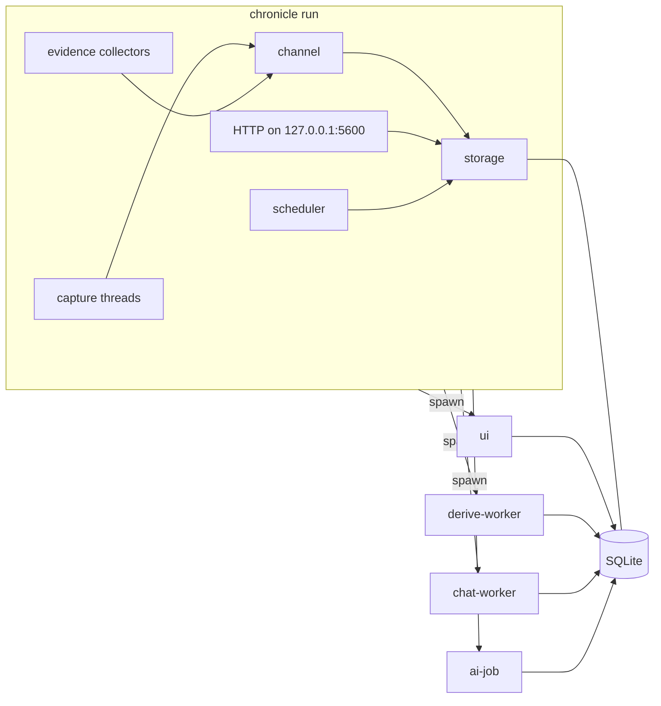
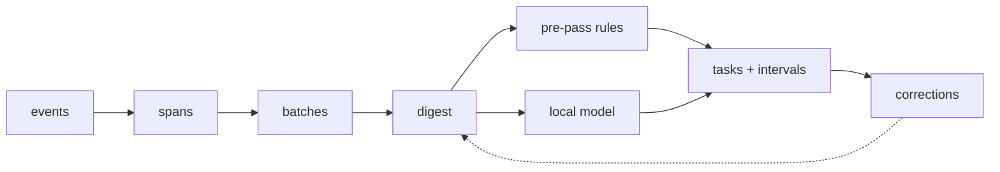

# Architecture

Chronicle is one binary that runs as a few cooperating processes around a single SQLite file. This page is the long form of the README's "How it works": the processes, the crates, the capture traits, and the rules the pipeline runs on.

## Process model

The daemon (`chronicle run`) captures and stores. Anything that needs a GPU, a language model or a window is a child process the daemon spawns from its own executable with a hidden subcommand, so a crash or a runaway allocation in any of them never takes capture down.

- **`ui`** is the egui window. `chronicle toggle`, the tray icon or a second `chronicle run` asks the daemon to show or hide it. The daemon spawns it once and toggles it over its stdin, and spawns a fresh one if it has exited.
- **`derive-worker`** holds the local model and a KV cache primed with the instruction prefix. The daemon starts it lazily, keeps it warm across batches, and lets it exit after `worker_idle_secs` without a request. Requests go down its stdin as JSON lines and replies come back on stdout.
- **`chat-worker`** is spawned per chat message, answers one exchange and exits.
- **`ai-job`** is spawned per queued job (a description, a journal entry, a standup, a narrative, a checkpoint, the nightly reconciliation), runs it and exits.

Inside the daemon, every capture thread and collector puts `CaptureEvent` values on one channel, and the storage thread drains it. Between processes there are two channels only: a Unix domain socket for the control protocol (`toggle`, `derive`, `consolidate`, `status`), and the database for everything with content. No child talks to another child.

Single-instance handling rides the socket. `chronicle run` first tries to connect to `chronicle.sock` and send `toggle`. If that succeeds a daemon is already running, so the new invocation has toggled its window and exits. Only when the send fails does it remove the stale socket and bind a fresh listener.

Shutdown goes through the same path. `SIGTERM` or `SIGINT` becomes a shutdown message on the control channel, and a second signal exits immediately. The shutdown path kills the derive worker and any running job and puts what they were working on back into a retryable state. Storing a derivation happens in one transaction, so there is no partial state to repair.

On macOS the tray has to live on the process's main thread, so the daemon loop runs on a spawned thread while the main thread hosts the Cocoa run loop. A panic hook exits the process if the daemon thread dies, since launchd only relaunches on exit.

## Crates

| Crate | Owns |
|---|---|
| `crates/core` | `Config`, the schema and migrations, the sessionizer, the digest, the pre-pass rules, anchor extraction and the segmenter, corrections, self-scoring, reports and standups, the connector registry. Depends on nothing else in the workspace. |
| `crates/capture` | Everything that touches the operating system: the four provider traits with one implementation per platform behind `#[cfg]`, and the evidence collectors (git, AI session transcripts, browser history, shell, editor state, calendars, microphone, Docker, ports, tmux). |
| `crates/server` | One Axum router on `127.0.0.1` speaking enough ActivityWatch and WakaTime to accept heartbeats from stock watchers and editor plugins, plus two routes for the shell and git hooks. It feeds the daemon's event channel. |
| `crates/derive` | Turning a digest into model output: prompt templates, the embedded llama.cpp runner under a GBNF grammar per job kind, embeddings, the redaction pass, and the cloud backends. |
| `crates/mcp` | A thin MCP client: config-driven, allowlisted calls only, everything returned treated as untrusted text. |
| `crates/app` | The `chronicle` binary: argument parsing, the daemon loop and scheduler, the egui UI, the worker entry points, and the CLI surfaces. The only crate that produces a binary. |

## Capture

Platform code lives behind four traits in `crates/capture`, and nothing outside the crate matches on a platform. Everything downstream consumes the `CaptureEvent` enum (`Focus`, `TitleChanged`, `Url`, `Activity`, `Afk`, `Lock`, `Presence`) and nothing else.

- **`FocusProvider`** is a blocking loop on its own thread that emits focus and title changes. If it exits, the daemon closes the open span rather than let time accumulate against a window nobody is looking at.
- **`AfkProvider`** is polled for how long the input devices have been idle.
- **`PresenceProvider`** reports one row of key, button, motion and scroll counts per minute that saw input. Counts only, never which keys.
- **`LockSignal`** calls back on every lock and unlock edge, including the initial state, so a session that starts locked is captured correctly.

The routes today:

| Platform | Focus | Idle | Presence | Lock |
|---|---|---|---|---|
| X11 | active window and title over X11 | screensaver extension | XInput 2 raw events | logind |
| Wayland, wlroots | foreign toplevel protocol | ext-idle-notify, or the KDE idle protocol | none | logind |
| Wayland, KDE | a KWin script over D-Bus | ext-idle-notify | none | logind |
| macOS | NSWorkspace and the Accessibility API | CoreGraphics idle clock | CoreGraphics event counters | session state |

On Wayland `focus_route` picks the route (`auto`, `wlr`, `kwin`), and `x11` forces X11 for Xwayland clients. On macOS, titles are empty until Accessibility access is granted; app names are captured either way. Windows is planned.

Adding a platform means one more `#[cfg]` module behind the same four traits, wired into the platform match in `crates/app/src/capture.rs`. Nothing downstream changes.

The evidence collectors are platform-independent. Each runs on its own thread and writes `activity_events` rows rather than going through the span pipeline. They are listed in [Sources](sources.md). One registry in `crates/core/src/connectors.rs` describes every collector, and drives `chronicle connections`, the Settings panel and the site's tools page. A test fails if the generated copies drift.

## Sessionizer and digest

This stage is deterministic and never calls the model, which is what makes it testable against golden fixtures.

**Events to spans.** Consecutive events on the same app merge into one span while the normalised title similarity stays at or above `title_similarity` (0.8 by default), or, for a browser span that carries a URL, while the site does not change. A span under five seconds never stands alone. It folds into an adjacent context-switching span so window flicks do not fragment the timeline. Idle time under the threshold folds into the span as quiet time. Once idle reaches `afk_close_secs` (120 s by default) the span closes and an AFK span begins. A screen lock closes the current span immediately.

**Spans to batches.** A batch accumulates non-idle spans until it holds `batch_minutes` (30) of activity, until an AFK gap of thirty minutes or more forces a break, or until a gap of five minutes or more closes it early once it has reached `batch_min_minutes` (10). Batches end at natural breaks, not only on a timer. The tail after the last closed batch stays unbatched until enough time accumulates.

**Digest.** A closed batch renders to a plain-text digest capped at 2 200 tokens, with a shortening ladder that drops the least important sections first. It carries apps and sites by time, a per-minute timeline, the keys, documents and people seen, the open tasks numbered so the model can refer to them by index, the pre-pass's own placements for confirmation, past corrections found through full-text search, work you ejected from a task, and workspace context fetched over MCP if configured. Both the pre-pass and the model read this one document.

## Derivation

**Pre-pass.** Before the model runs, rules place what they can, in order: a ticket key in a title or branch name, the working directory a terminal or editor names, a window filed under a task before, and a matching past correction. Each placement gets a provisional interval at confidence 0.5 that shows on every surface at once and is replaced when derivation runs. A correction where you ejected similar work from a task is a hard negative that stops the pre-pass from putting the same kind of block back.

**Model.** What the pre-pass cannot place goes to the derive worker, which runs llama.cpp on the prompt in `prompts/` under the matching grammar in `grammars/`. The grammar is the containment: the model can only emit interval JSON that references an open task by its digest index or proposes a new label. It has no way to do anything else with the untrusted text in its context.

**Segmenter.** `derive_mode = "segmenter"` swaps the model-driven batch step for a deterministic one. It clusters spans by which typed anchors keep recurring (a ticket key, a branch, a document, a place), scores each cluster against every task's evidence profile, uses hysteresis so a momentary glance folds back into the surrounding work, and asks the model only to name clusters that match nothing. The default is the model path.

**After the model.** The output is untrusted and goes through fixed passes before it is stored. References outside the digest's task list and blank labels are dropped. Near-identical proposals for the same project snap together instead of minting duplicates. Adjacent pieces in the same task coalesce, but never across an AFK gap of five minutes or more. Every interval is clamped to the batch window, and anything empty or inverted is dropped. Once a day a consolidation pass folds orphan single-batch tasks into the task around them and lets the model merge obvious duplicates or rename vague labels, re-checked by the same guards, and recorded as one undoable correction.

**Scheduler.** Inference starts when it will not be felt: after `derive_idle_secs` (300) of idle time or a screen lock, or whenever the one-minute load average is already low, and never below thirty percent battery while discharging. A live tier runs every `live_secs` while you are working to label the newest stretch of the open batch, so the window is not blank until the batch closes. The batch derive later replaces whatever the live tier guessed.

**Corrections.** A rename, merge, reassignment or eject becomes a correction. Corrections reach the next digest as examples found by full-text search or by embedding similarity, and reach the pre-pass as rules. Nothing is retrained.

**Cloud backends.** Optional and off by default. A backend in `models.toml` with your own key, plus a route naming it for a job kind, sends that job's prompt through the redaction pass and to the provider. The output goes through the same grammar and guards. `chronicle bench` scores any backend against the fixtures.

## The model-written layer

Longer prose is decoupled from derivation through the `ai_jobs` queue. The daemon enqueues a job when a new task needs a description, when a batch closes and a journal entry is due, when a day ends and a standup or narrative is wanted, and when an idle stretch calls for a checkpoint. An ephemeral `ai-job` process claims one job, gathers its context from the database, runs it through the same prompt, grammar and backend machinery, stores the result or marks the job failed, and exits. Jobs wait for the same idle gate as derivation, except the ones a person is waiting on in the window, which run at once.

Chat is grounded the same way. A question is matched against a time reference to pick a date range, falling back to full-text search over task labels and span titles and then to today. The activity rows for that range are rendered as context, and a question that asks for a quantity carries a SQL totals table the prompt must quote rather than add up itself. The context budget scales with the backend: the local model gets the digest cap, and a cloud backend gets an order of magnitude more.

## Storage

One SQLite database in WAL mode through `rusqlite`, with FTS5 compiled in. Migrations in `crates/core/migrations/` are embedded at compile time and applied on open by every process, so a database at any older version comes forward automatically. Foreign keys are off for the migration run and on afterwards.

Capture writes `events`, `spans`, `activity_events` and `presence`. Derivation writes `batches`, `tasks`, `intervals` and `corrections`. The evidence layer writes `span_anchors`, `task_evidence` and `claims`. The model-written layer writes `ai_jobs`, `narratives`, `journal_entries` and the embedding tables, and `self_score` holds the daily measurement. [Data and privacy](data.md) describes every table.

Every stored timestamp is a UTC unix millisecond. Day boundaries are never stored; they are computed at query time in the system time zone with `jiff`, so a DST day is 23 or 25 hours long. Retention runs in the idle gate, in small batches, at most once a day.

## HTTP endpoint

The daemon binds `127.0.0.1:5600` (`port`) to accept activity from tools it cannot poll. It answers enough of the ActivityWatch API for the stock browser extension to report tab changes, folded into one URL event per real page change. It answers the WakaTime heartbeat routes for editor plugins, folded into `edit` events keyed by project and branch, behind `editor_heartbeats` and an API key shown in Settings. Two more routes take posts from Chronicle's own shell hook and git hooks.

Every request, including a 404, passes one guard first: the `Host` header must be the loopback address and port, which defends against DNS rebinding. CORS allows the known extension origins plus whatever `cors_allow` adds.

## Conventions

`anyhow` in the binary and `thiserror` in the libraries. `tracing` into a rotating file log capped at 5 MB. Stable Rust, pinned by `rust-toolchain.toml`. Tests are fixture-driven: a mock `FocusProvider` replays a recorded JSONL stream from `fixtures/`, the sessionizer and digest are compared against golden files, and derivation quality is scored by `chronicle bench` against `fixtures/*.expect.json`. Every change passes `cargo fmt --check`, `cargo clippy --workspace --all-targets -- -D warnings` and `cargo test --workspace` before it lands.
